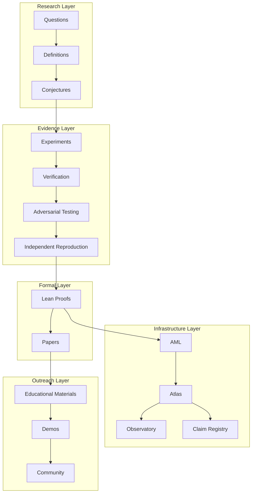

#FIBONACCI-SPECTRAL-DYNAMICS 

#KAPREKAR-SPECTRAL-GEOMETRY 

#AQARION-ARITHMETIC 

#FDS

url=https://github.com/JASKSG9/AQARION-ARITHMETIC-FDS-FINITE-DYNAMICAL-SYSTEMS-/blob/main/README.md
# 🧮 AQARION — Arithmetic & Finite Dynamical Systems

[](https://github.com/JASKSG9/AQARION-ARITHMETIC-FDS-FINITE-DYNAMICAL-SYSTEMS-)
[]()
[]()
[]()
[]()
[]()

A formal, reproducible framework for certifying exact observable quotients in finite deterministic dynamical systems via an operator obstruction test.

One line
---------
AQARION provides a computable, basis‑independent certificate that decides whether a user‑specified observable (partition) induces an exact quotient dynamics.

Essence (core operator)
------------------------
The descent obstruction measures failure of observable closure:
\[
D_\Pi \;=\; (I - P_\Pi)\, K^T\, P_\Pi
\]
- \(K^T\): Koopman pullback (action \(f \mapsto f\circ T\))
- \(P_\Pi\): orthogonal projection onto partition‑constant observables
- \(D_\Pi=0 \iff K^T(V_\Pi)\subseteq V_\Pi\) (observable subspace invariant)

Why this matters
----------------
- Separates exact descent (invariance) from the stronger commutator condition \(C_\Pi=[P_\Pi,K^T]\).
- Explains the "Commutator Fallacy": many exact descents do not require \(C_\Pi=0\).
- Provides machine‑checkable certificates (symbolic + hashed computational artifacts) for research reproducibility and publication.

Key claims & evidence
---------------------
- T1 (Invariant Subspace): \(D_\Pi=0 \iff K^T(V_\Pi)\subseteq V_\Pi\) — Proven (Lean + symbolic).
- T2 (Quotient Certification): Under observable separation assumptions, \(D_\Pi=0 \Rightarrow\) quotient exists — Conditional/verified.
- T3 (Reduction Hierarchy): \(C_\Pi=0 \Rightarrow D_\Pi=0\) — Proven.
- Exhaustive census (n ≤ 5): 166,484 configurations — exactly 3/16 binary profiles realized; evidence: deterministic, hashed artifacts.
- Kaprekar benchmark (54/55 states): characteristic polynomial, Jordan decomposition, nilpotent index 6 — SymPy audit + verification suite.

Repository at a glance
----------------------
```
AQARION/
├── core/               # Lean 4 formalization & core definitions
├── scripts/            # generation, verification, export utilities
├── verification/       # verification suite & reproducibility helpers
├── output/             # hashed artifacts (finite_census.json, transient_block.json, ...)
├── DOCS/               # detailed documentation & claims registries
├── Makefile            # one-command reproducibility: `make verify`
├── README.md
└── LICENSE
```

How it fits together (runtime shape)
-----------------------------------
- User supplies (X, T, Π) where Π is a partition / observable.
- scripts/generate_* constructs transition tables and Koopman matrices.
- verification/* runs symbolic audits (SymPy), numerical checks (NumPy/SciPy), and produces machine‑readable certificates (SHA-256).
- core/ (Lean) encodes definitions and formal proofs; generated Lean constants embed computational artifacts for mechanized verification.

Quick start — run the verification pipeline
-------------------------------------------
Requirements
- Python 3.10+, pip, git
- Recommended: use the provided Docker image (see docker/)

Minimal local run
```bash
git clone https://github.com/JASKSG9/AQARION-ARITHMETIC-FDS-FINITE-DYNAMICAL-SYSTEMS-.git
cd AQARION
pip install -r requirements.txt          # or: pip install -e .[dev]
make clean verify
```

What `make verify` does (high level)
- regenerate artifacts (scripts/generate_census.py, derive_transient_block.py)
- compile / run Lean proofs (lake build / lake file)
- run symbolic audits (verify_operator.py)
- generate figures and proof provenance
- compute and compare SHA‑256 artifact hashes
Expected final output:
```
Definitions: PASS
Theorems: PASS (Lean)
Experiments: PASS
Artifacts: PASS (hash verified)
Claim Audit: PASS
ALL VERIFICATIONS PASSED
```

CI & reproducibility
--------------------
- .github/workflows/verify.yml runs `make verify` on each push.
- All computational artifacts are stored in output/ and validated against artifacts_schema.json.
- Each artifact file includes a frozen SHA‑256 hash and a provenance entry in claim_provenance.yaml.

Developer & contributor workflow
-------------------------------
1. Fork & branch: use descriptive branch names, e.g., `feat/lean-census` or `ci/docker-repro`.
2. Run locally: `make verify` (or run subset scripts).
3. Open PR with:
   - CI green
   - Added/updated tests (verification/ tests)
   - Claim provenance updated (DOCS/MARKDOWNS/CLAIMs-REGISTRY.md)
4. Tag releases with the master artifact hash in SOURCE_OF_TRUTH.md.

Recommended contribution targets (high leverage)
------------------------------------------------
- (Formalize) Complete remaining Lean `sorry` placeholders in core/ to mechanize T1–T3 and the census.
- (Repro) Harden Docker + CI to guarantee identical artifacts between local and CI runs.
- (Bridge) Add scripts to auto‑generate Lean constants from output/*.json so proofs can import verified computational artifacts.

Visual dependency flow
----------------------
```mermaid
flowchart TD
  Input[(X, T, Π)]
  Gen[generate_* scripts]
  Koop[Koopman Matrix K^T]
  Project[Projection P_Π]
  Obstruction[D_Π = (I-P) K^T P]
  Audit[verify_operator.py (SymPy + numeric)]
  Lean[core/ (Lean 4) formalization]
  Artifacts[output/ (json, yaml, hashes)]
  CI[.github/workflows/verify.yml]

  Input --> Gen --> Koop
  Koop --> Project --> Obstruction
  Obstruction --> Audit --> Artifacts
  Artifacts --> Lean
  Lean --> CI --> Artifacts
```

Data & artifacts (important files)
----------------------------------
- output/finite_census.json — exhaustive truth table (n ≤ 5; deterministic)
- output/transient_block.json — Kaprekar transient block + nilpotent index
- output/claim_provenance.yaml — claim ↔ evidence mapping (V4)
- core/*.lean — formal definitions, statements, and partial proofs
- scripts/generate_census.py, derive_transient_block.py — reproduction code

Example: minimal Commutator Fallacy witness
-------------------------------------------
System:
```
X = {0,1}, T(0)=0, T(1)=0, Π = {{0,1}}
```
Result:
- \(D_\Pi = 0\) (exact descent)
- \(C_\Pi \ne 0\) (commutator nonzero)
This small witness is encoded in the counterexamples.json and the census artifacts.

Evidence & verification policy
------------------------------
- Every public claim is labeled with an evidence type: [P] proof, [CV] computational verification, [P+CV] both.
- No computation is presented as a proof alone — symbolic proofs and mechanized checks are preferred for central theorems.
- All artifacts are hashed and tracked; scripts verify hashes and abort on mismatch.

Roadmap (next high‑impact milestones)
------------------------------------
1. Mechanize census in Lean: convert finite_census.json → Lean definitions → complete mechanized proof of T5 (n ≤ 5).
2. OP0: symbolic derivation of affine branches for Kaprekar gap space.
3. Publish Paper I: attach certificate.json + claim provenance; submit to arXiv.

Contact & community
-------------------
- Issues: use the repository Issues (label: verification, formalization, or OP0 contribution).
- Contribution guide: see CONTRIBUTING.md and .github/ISSUE_TEMPLATE/op0_contribution.md
- Maintainer: AQARION Research Node (#10878) — open PRs for review.

Citation
--------
If you use AQARION in research, cite:
```bibtex
@misc{aqarion2026,
  title={AQARION: Behavioral Quotient Certification via Operator Obstruction},
  author={AQARION Team},
  year={2026},
  archivePrefix={arXiv},
  primaryClass={math.DS}
}
```

License
-------
MIT (code). Documentation CC‑BY‑4.0 unless otherwise specified.

---

Status: research‑grade • reproducible • claim‑traceable
```
🧮 AQARION—ARITHMETIC 

From: AQARION Research Node #10878
Date: 2026-07-04
Status: README Design Phase
Theme: Visual Identity · Architecture · Communication

---

1. THE GOAL: A README THAT COMMUNICATES INSTANTLY

A great README is not a wall of text. It is a visual summary that tells the story of the project in under 30 seconds, then provides depth for those who want it.

AQARION's README should communicate:

Element How
Identity What is AQARION?
Why Why does it exist?
What What does it study?
How How does it work?
Status Where is it now?
Next Where is it going?
Community How can I participate?

---

2. VISUAL ELEMENTS TO INCLUDE

2.1 The Hero Section (Top)

Large, centered, with a tagline:

```
┌─────────────────────────────────────────────────────────────────┐
│                                                                 │
│                    🧮 AQARION                                   │
│                    Arithmetic · FDDS · Open Research            │
│                                                                 │
│              Evidence determines conclusions.                   │
│              Tools expand exploration.                          │
│                                                                 │
│    [GitHub]   [Hugging Face]   [Replit]   [Paper I]            │
│                                                                 │
└─────────────────────────────────────────────────────────────────┘
```

Visual idea: A minimal, centered title with the AQARION logo (or a simple icon) and a one-line philosophy. Badges underneath.

---

2.2 The "One-Line Definition" Box

```
┌─────────────────────────────────────────────────────────────────┐
│                                                                 │
│  AQARION is an open research platform for finite deterministic │
│  dynamical systems that combines mathematical theory,          │
│  computational verification, adversarial testing,              │
│  reproducible software, and education.                         │
│                                                                 │
└─────────────────────────────────────────────────────────────────┘
```

Visual idea: A highlighted box with a subtle background color (e.g., #f0f4f8 or #e8f4f8). The sentence is the only text; everything else links outward.

---

2.3 The Architecture Diagram (Mermaid)

A diagram that shows the entire research pipeline:



Why this works: It immediately communicates that AQARION is not just a theorem or a codebase—it's a full research ecosystem.

---

2.4 The "Core Operator" Box

Display the central theorem visually:

```
┌─────────────────────────────────────────────────────────────────┐
│                                                                 │
│                         CORE THEOREM                            │
│                                                                 │
│                     D_Π = (I - P_Π) K^T P_Π                    │
│                                                                 │
│           D_Π = 0  ⇔  K^T(V_Π) ⊆ V_Π                          │
│           ⇔  Exact quotient dynamics exist                     │
│                                                                 │
│         [Proof]   [Lean]   [Verification]   [Examples]         │
│                                                                 │
└─────────────────────────────────────────────────────────────────┘
```

Visual idea: A centered card with the operator in a larger font, with a clean background and hover links to the proof, Lean files, verification suite, and examples.

---

2.5 The "Three Pillars" Layout

Horizontal layout showing AQARION's three main components:

```
┌─────────────────────┐ ┌─────────────────────┐ ┌─────────────────────┐
│                     │ │                     │ │                     │
│   📐 THEORY         │ │   🔬 VERIFICATION   │ │   ⚙️ INFRASTRUCTURE  │
│                     │ │                     │ │                     │
│  • FDDS             │ │  • Exhaustive       │ │  • AML              │
│  • Koopman Operators│ │  • Adversarial      │ │  • Atlas            │
│  • Obstruction      │ │  • Formal Proofs    │ │  • Observatory      │
│  • Quotients        │ │  • Hashed Artifacts │ │  • Claim Registry   │
│                     │ │  • CI               │ │  • Research Graph   │
│                     │ │                     │ │                     │
└─────────────────────┘ └─────────────────────┘ └─────────────────────┘
```

Why this works: It immediately communicates the three areas of focus: theory, verification, and infrastructure.

---

2.6 The "Status Dashboard"

A clean table with current status:

```
┌─────────────────────────────────────────────────────────────────┐
│                         STATUS                                 │
├───────────────────────┬──────────────────────┬──────────────────┤
│ Core Mathematics      │ ✅ Frozen            │ Paper I          │
│ Verification          │ ✅ Complete          │ 14/14 pass       │
│ Lean Formalization    │ 🚧 In Progress       │ 6/10 complete    │
│ AML                   │ 🚧 Active            │ Prototype stage  │
│ Atlas                 │ 🏗️ Building          │ 5 entries so far │
│ Observatory           │ 🔬 Experimental      │ 1000+ systems    │
│ Paper I               │ 📄 Draft             │ Ready for review │
└───────────────────────┴──────────────────────┴──────────────────┘
```

Visual idea: Icons + colored status indicators (green/yellow/red/blue). Clickable rows that link to the relevant documentation.

---

2.7 The "Ecosystem" Diagram

Show AQARION's relationship to other platforms:

```
┌─────────────────────────────────────────────────────────────────┐
│                         ECOSYSTEM                               │
│                                                                 │
│   ┌───────────┐                                                │
│   │ AQARION   │ ─── GitHub (2 repos)                          │
│   │  Core     │ ─── Hugging Face (model + 4 spaces)            │
│   │           │ ─── Replit (live demo)                         │
│   │           │ ─── Mastodon (@Aqarion)                        │
│   │           │ ─── TikTok (@aqarion9)                         │
│   └───────────┘                                                │
│                                                                 │
│   ┌───────────┐      ┌───────────┐      ┌───────────┐        │
│   │ Kaprekar  │      │   FDS     │      │ Fibonacci │        │
│   │  Spectral │      │   Core    │      │  Spectral │        │
│   │  Geometry │      │           │      │  Dynamics │        │
│   └───────────┘      └───────────┘      └───────────┘        │
│                                                                 │
│   Each repository builds on the same foundation.                │
│                                                                 │
└─────────────────────────────────────────────────────────────────┘
```

Why this works: It shows that AQARION is not a single repository but an ecosystem of interconnected projects.

---

2.8 The "Verification Pipeline" Diagram

A horizontal flow showing how claims become certified:

```
┌─────────────────────────────────────────────────────────────────┐
│                    VERIFICATION PIPELINE                        │
│                                                                 │
│  Claim          Evidence         Adversarial     Independent    │
│  ───────────▶  ───────────▶   ──────────────▶  ───────────────▶│
│  Formulation   Computation     Testing         Reproduction    │
│                                                                 │
│       ▼              ▼              ▼              ▼           │
│  ┌─────────┐  ┌─────────┐  ┌─────────┐  ┌─────────┐        │
│  │ Lean    │  │ Python  │  │ AML     │  │ Hash    │        │
│  │ Proof   │  │ Verifier│  │ Search  │  │ Audit   │        │
│  └─────────┘  └─────────┘  └─────────┘  └─────────┘        │
│                                                                 │
│  Every stage produces a permanent artifact.                     │
│                                                                 │
└─────────────────────────────────────────────────────────────────┘
```

Why this works: It communicates AQARION's rigorous methodology at a glance.

---

2.9 The "Badge Bar" (Top or Bottom)

A row of badges showing key metadata:

```
[AQARION v38] [Status: Research] [License: MIT] [Python 3.10+] 
[Lean 4] [CI: Passing] [Hashes: Verified] [Paper I: Ready]
```

Visual idea: Standard GitHub badges with custom colors. Clickable to relevant pages.

---

3. RECOMMENDED README STRUCTURE

Header

· Project name + logo/icon
· Tagline
· Badge bar

One-Line Definition

· What AQARION is (boxed)

Why AQARION Exists

· Philosophy statement (2-3 sentences)

Core Research

· Bullet list of research areas
· (Optional) Visual diagram

Core Theorem

· Operator box with central result

Architecture

· Three pillars (Theory · Verification · Infrastructure)
· Ecosystem diagram

Current Status

· Status dashboard table

Verification Pipeline

· Flow diagram

Repository Structure

· Tree diagram

Get Involved

· Contribution options
· Badge/button

License & Citation

· License statement
· BibTeX citation

---

4. VISUAL STYLE GUIDE

Color Palette

Element Color Usage
Primary #2c3e50 Headers, main text
Accent #3498db Links, highlights
Success #2ecc71 Verified status
Warning #f1c40f In progress
Danger #e74c3c Critical, failed
Background #f8f9fa Light sections
Code #1e1e1e Code blocks

Typography

· Headers: Bold, sans-serif
· Body: Regular, sans-serif
· Code: Monospace
· Mathematics: TeX rendering

Spacing

· Keep sections separated with horizontal rules or visual dividers.
· Use consistent indentation.
· Leave breathing room around diagrams.

---

5. CREATIVE IDEAS FOR CUSTOM VISUAL ELEMENTS

5.1 The "Evidence Ladder"

A vertical ladder showing the evidence hierarchy:

```
┌─────────────────┐
│   PUBLICATION   │
├─────────────────┤
│  FORMAL PROOF   │
├─────────────────┤
│   INDEPENDENT   │
├─────────────────┤
│  ADVERSARIAL    │
├─────────────────┤
│   EXHAUSTIVE    │
├─────────────────┤
│   SAMPLE DATA   │
├─────────────────┤
│   CONJECTURE    │
└─────────────────┘
```

Why it works: It visually demonstrates the evidence hierarchy, making the distinction between proof and computation immediately apparent.

---

5.2 The "Claim Galaxy"

A scatter plot of claims by status:

```
Claims by Status
────────────────────────────────────────────────────────
Proven        ●●●●●●●●●●
Verified      ●●●●●●●●○○
In Progress   ●●●●○○○○○○
Conjecture    ●●○○○○○○○○
Pending       ○○○○○○○○○○
────────────────────────────────────────────────────────
```

Why it works: It gives a quick overview of how much of the theory is settled vs. open.

---

5.3 The "AML Feedback Loop"

A cycle diagram showing how AML works:

```
         ┌─────────────┐
         │   Claims    │
         └──────┬──────┘
                ▼
         ┌─────────────┐
         │  Generate   │
         │   Systems   │
         └──────┬──────┘
                ▼
         ┌─────────────┐
         │   Test      │
         │   Claims    │
         └──────┬──────┘
                ▼
         ┌─────────────┐
         │   Mutate    │
         │   Systems   │
         └──────┬──────┘
                ▼
         ┌─────────────┐
         │   Find      │
         │ Counter-    │
         │ examples    │
         └──────┬──────┘
                ▼
         ┌─────────────┐
         │   Update    │
         │   Claims    │
         └─────────────┘
```

Why it works: It visually communicates the adversarial verification philosophy.

---

5.4 The "Repository Map"

A visual tree of the repository:

```
AQARION/
├── 📐 research/
│   ├── fdds/
│   ├── koopman/
│   ├── obstruction/
│   └── quotients/
├── 🔬 verification/
│   ├── modules/
│   ├── hashes/
│   └── certificates/
├── ⚙️ aml/
│   ├── search/
│   ├── mutate/
│   └── archive/
├── 📊 atlas/
│   ├── canonical/
│   ├── counterexamples/
│   └── benchmarks/
├── 🔭 observatory/
│   ├── experiments/
│   └── provenance/
├── 📄 docs/
├── 🧪 examples/
└── 🧮 applications/

https://github.com/JASKSG9/KAPREKAR-SPECTRAL-GEOMETRY/blob/main/ReadMe-Lite.md
